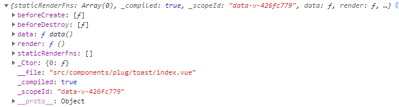

### 应用配置
```markdown
每个Vue应用都会暴露一个 config 对象
eg:
    const app = createApp({})
    app.config
| 参数名 | 参数类型 | 默认值 | 用法 |
| errorHandler  |  function    |  underfined   |  app.config.errorHandler = (err, vm, info) => {         |
                                                    // 处理错误
                                                    // `info` 是 Vue 特定的错误信息，比如错误所在的生命周期钩子
                                                   }  
                                                   指定一个处理函数，来处理组件渲染方法和侦听器执行期间抛出的未捕获错误。
                                                   这个处理函数被调用时，可以获取错误信息和应用实例
Vue.config.productionTip: 设置为false， 阻止vue在启动时生成生产提示----you are running vue in development mode
```
### 全局API
```markdown
# Vue.extend(options)

用法：使用基础的Vue构造器，创建一个“子类”。参数是一个包含组件选项的对象。
data 选项，在Vue.extend()中它必须是函数
eg:
    vue-reuse\src\components\plug\toast\index.vue 是一个组件模板模板
    vue-reuse\src\components\plug\toast\index.js 注册组件
        引入组件模板
        import ToastComponent from './index.vue'
        使用Vue.extend创建子类：
        Vue.extend(ToastComponent)


# Vue.nextTick([callback,context])
用法：在下次DOM更新循环结束之后执行延迟回调。在修改数据之后立即使用这个方法，获取更新后的DOM

# Vue.set(target,propertyName/index,value)
    *target不能是Vue实例，或者Vue实例的根数据对象
# Vue.delete(target, propertyName/index)
    *target不能是Vue实例，或者Vue实例的根数据对象  
# Vue.directive(id, [definition])
用法：注册或获取全局指令
# Vue.filter(id,[definition])
用法： 注册或获取全局过滤器
eg:
    // 注册
    Vue.filter('my-filter', function (value) {
         // 返回处理后的值
    })
# Vue.observable(object)
参数: {object} object
用法：让一个对象可响应。Vue内部会用它来处理 data 函数返回的对象。
     返回的对象可以直接用于渲染函数和计算属性内，并且会在发生变更时触发响应的更新。也可以作为最小化的跨组件状态存储器，用于简单的场景。
```
### 选项/数据
```markdown
# data
当一个组件被定义，data必须声明为返回一个初始数据对象的函数，因为组件可能被用来创建多个实例。如果data仍然是一个纯粹的对象，则所有的
实例将共享引用同一个数据对象.通过提供data函数，每次创建一个新实例后，我们能够调用data函数，从而返回初始数据的一个全新副本数据对象。
```