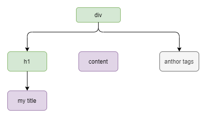

### 渲染函数 & JSX
一、节点、树以及虚拟DOM
```angular2html
<div>
  <h1>my title</h1>
  content
<!--  anthor tags-->
</div>
```
当浏览器读到这些代码时，它会建立一个“DOM节点树”来保持追踪所有内容。
上述HTML对应的DOM节点树如下图所示

每个元素都是一个节点。每段文字也是一个节点。甚至注释也都是一个节点。就像家谱树一样，每个节点都可以有孩子节点
也就是说每个部分可以包含其他的一部分内容。
-------------------------------------
```markdown
虚拟DOM
Vue 通过建立一个虚拟DOM来追踪自己要如何改变真实DOM。
eg:
return createElement('h1', this.blogTitle)

createElement返回：不是一个实际的DOM元素。它更准确的名字可能是createNodeDescription，因为它所包含的信息会告诉Vue
页面上需要渲染什么样的节点，包括及其子节点的描述信息。
我们把这样的节点描述为“虚拟节点”，也简写为“VNode”。虚拟DOM是我们对由Vue组件数建立起来的整个VNode树的称呼。
```
```javascript
// createElement参数
// return {VNode}
createElement(
  // {String | Object | Function}
  // 一个 HTML 标签名、组件选项对象，或者
  // resolve 了上述任何一种的一个 async 函数。必填项。
  'div',

  // {Object}
  // 一个与模板中 attribute 对应的数据对象。可选。
  {
    // (详情见下一节)
  },

  // {String | Array}
  // 子级虚拟节点 (VNodes)，由 `createElement()` 构建而成，
  // 也可以使用字符串来生成“文本虚拟节点”。可选。
  [
    '先写一些文字',
    createElement('h1', '一则头条'),
    createElement(MyComponent, {
      props: {
        someProp: 'foobar'
      }
    })
  ]
)
```


